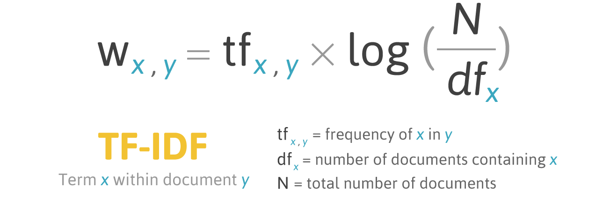

# NLP Fundamentals

Welcome to the NLP Fundamentals repository, where we explore various fundamental concepts and techniques in Natural Language Processing (NLP). Below are the main topics covered:

## Table of Contents

1. [NLP Use Cases](#nlp-use-cases)
2. [NLP Pipelines](#nlp-pipelines)
3. [Spacy vs NLTK](#spacy-vs-nltk)
4. [Text Cleaning](#text-cleaning)
4. [Tokenization in Spacy](#tokenization-in-spacy)
5. [Language Processing Pipeline in Spacy](#language-processing-pipeline-in-spacy)
6. [Stemming and Lemmatization](#stemming-and-lemmatization)
7. [Part Of Speech (POS) Tagging](#part-of-speech-pos-tagging)
8. [Named Entity Recognition (NER)](#named-entity-recognition-ner)
9. [Text Representation](#text-representation)
   - Label One-Hot Encoding
   - Bag of Words
   - Stop Words
   - Text Representation using Bag of N-grams
   - Using TF-IDF (Term Frequency-Inverse Document Frequency)
   - Using Word Embeddings
   - Word Vectors in Spacy
   - Classification using Word Vectors in Spacy
   - Word Vectors in Gensim

## NLP Use Cases

I will discuss few of them and add other use cases too:

**Text Classification:**  Sorting text into predefined categories
like spam detection in emails or sentiment analysis in customer 
reviews.

**Information Extraction/Gathering:** Identifying and extracting 
specific pieces of information from text,
such as names, dates, or events from news articles.

**Chat Bots:** AI-powered programs that simulate human 
conversation, used for customer 
support, information retrieval, or entertainment.

**Text Summarization:** Condensing large amounts of text into 
shorter, coherent summaries, 
often used for news articles or research papers.

**Machine Translation:** Automatically translating text from one language to another.

As you can see NLP is quite cool and useful skill to learn (:

## NLP Pipelines

Building NLP means perform various steps starting from data collection, cleaning 
end to deployment, monitoring, all of those steps are called NLP pipeline:

**Data Acquisition:** This is the first step in the pipeline, and it involves collecting text data from a variety of sources, such as the web, social media, or customer reviews.

**Text Cleaning:** Once the data has been collected, it needs to be cleaned. This step involves removing irrelevant information, such as HTML tags, punctuation, and stop words. Stop words are words that are common in a language but do not provide much meaning, such as "the", "a", and "is".

**Pre-processing:** After the text has been cleaned, it is pre-processed. This step involves breaking the text down into smaller units, such as words or phrases (tokenization), and converting the words to their base form (lemmatization or stemming).

**Feature Engineering:** In this step, features are extracted from the text data. Features are numerical representations of the text that can be used by machine learning models. There are many different feature engineering techniques, such as bag-of-words and TF-IDF.

**Modeling:** Once the features have been extracted, they are used to train a machine learning model. The model can then be used to perform a variety of NLP tasks, such as sentiment analysis, text classification, or machine translation.

**Evaluation:** After the model has been trained, it is evaluated to assess its performance. This step involves testing the model on a set of unseen data and measuring how well it performs.

**Deployment:** If the model performs well on the evaluation task, it can be deployed into production. This means that the model can be used to make predictions on new data.

**Monitoring and Model Updating:** Once the model is deployed, it is important to monitor its performance over time. If the model's performance starts to degrade, it may need to be updated with new data or retrained.

## Spacy vs NLTK
**Spacy:** Object-oriented approach. Spacy provides most efficient algorithms for particular tasks, 
don't gives you a lot of choice but the best one.

**NLTK:** String processing library. NLTK give you broader choice of algorithms,
it is more customizable, good for researchers.

**Overally both library have their use, and both is the good, but I'm going to use Spacy.**
*

## Text Cleaning
There are few important steps for text cleaning:

**Lowercasing**

**Remove HTML tags**

**Remove URLS**

**Remove Punctuations**

**Spelling Correction**

**Handling Emojis**

And so on, It's basically depends on data.

## Tokenization in Spacy

**Tokenization** is process of splitting text into meaningful segments, parts.

**Sentence Tokenization:** Split sentences 

**Word Tokenization:** Split words

Both Sentence and Word Tokenizer code implementation in Spacy: [Tokenization](Tokenization.py)

### Token Attributes 
 Token have a lot of different attributes, For instance

**LIKE_NUM:** which checks whether token in numerical value.

**LIKE_EMAIL:** Token text look like an email address. 

**LIKE_URL:** 	Token text looks like a URL. 

And there are a lot of different ones like that which helps to understand token context.

## Language Processing Pipeline in Spacy

There is code:  [Language Processing Pipeline](LanguageProcessingPipeline.py)

**explanation**

This code demonstrates basic NLP processing with SpaCy. 
It first tokenizes the input text, which breaks it down into individual
words and punctuation. For each token, the script prints the token text, its
part-of-speech tag, and its lemma (base form). It then identifies named entities 
(like people or organizations) in the text, printing each entity's text, label,
and a description of the label. This process shows how to extract and analyze 
text.

## Stemming and Lemmatization
**Stemming:** Use fixed rules, for example talking -> talk, For that you can simply use regex and get base words.

**Lemmatization:** Whenever you need to use knowledge of language, or linguistic knowledge, you need lemmatization, base word is called lemma.

**spaCy does not support stemming, for that reason I'm going to use NLTK**

Let's compare Stemming and Lemmatization results:

### Stemming results:

### Lemmatization results:

As you can see as a machine when you have linguistic knowledge you make better job ()

There is implementation of code + custom lemmatization of words:
[Stemming And Lemmatization](StemmingLemmatization.py)

## Part Of Speech (POS) Tagging

**POS:** Sentence is made up with different parts, and those parts are called part of speech.
There are different POS tags:

**Noun:** Represents a person, place, thing, or idea.
Example: "cat," "city," "happiness."

**Verb:** Expresses an action, occurrence, or state of being.
Example: "run," "is," "seem."

**Adjective:** Describes or modifies a noun or pronoun.
Example: "happy," "blue," "quick."

**Adverb:** Modifies a verb, adjective, or other adverb, often indicating how, when, or where something happens.
Example: "quickly," "very," "there."

**Pronoun:** Replaces a noun to avoid repetition.
Example: "he," "she," "it."

**Preposition:** Shows the relationship between a noun or pronoun and other words in a sentence.
Example: "in," "on," "under."

**Conjunction:** Connects words, phrases, or clauses.
Example: "and," "but," "because."

**Interjection:** Expresses strong emotion or reaction.
Example: "wow," "ouch," "hey."

**Determiner:** Introduces a noun and specifies its reference.
Example: "the," "a," "my."

**Auxiliary Verb:** Helps form different tenses, moods, or voices of verbs.
Example: "have," "will," "can."

**In practice it have great use. For instance, it can be used to identify POS in sentences, find out distribution of them. 
Moreover, there are type of POS which is not needy for NLP tasks and we can remove them such as interjections(like "wow" or "ouch") 
Auxiliary Verbs(like "is," "will"), Determiners(like "the," "a"), 
Removing or ignoring these types of POS can streamline processing and focus on the most relevant features for specific tasks.**

## Named Entity Recognition (NER)

**Named Entity Recognition (NER)**  has numerous applications, including enhancing search capabilities and enabling 
data-driven insights. By extracting entities such as locations, organizations, and individuals from text, NER improves
information retrieval and organization. This technology is pivotal in refining search engine results, automating content 
categorization, and powering recommendation systems. Additionally, NER aids in sentiment analysis, fraud detection, and 
customer service automation by identifying and classifying relevant entities within large volumes of unstructured data.

## Text Representation

**I'm done preprocessing so far, next part is Feature Engineering(text representation)**

### Label One-Hot Encoding

**Label Encoding:** Representing text using numbers, For instance, "I Love AI" can be represented as [1,2,3], where 1 is I, 2 is Love, 3 is AI.
This is primitive way to represent text.

**One-Hot Encoding:** One-hot encoding turns categories into binary numbers. Each category is represented as a vector with a single '1' in 
the position that matches the category, and '0's in all other positions. This is primitive way too.

**Those two method have a lot of disadvantages such as they consume a lot of memory, they don't understand meaning of words, etc**

### Bag of Words

**Bag of words** is a method that counts how often each word appears in a text. These counts are used to create a list of 
numbers (vectors) representing the text. It ignores grammar and word order.

This approach have following problems:

1 -> It requires a lot of memory still, but compared one-hot encoding less.

2 -> It does not understand meaning of words

Dataset Link: https://www.kaggle.com/datasets/lakshmi25npathi/imdb-dataset-of-50k-movie-reviews?resource=download

Dataset and code which implements review classifier model: [Review Classifier](BOW.py)

### Stop Words

**Stop Words** are common words such as "the", "a", "in", and "on". These words often create noise in NLP projects, so it is generally sensible to remove them. 
However, the necessity of removing stop words depends on the specific task and objectives.

For example, if we are using the Bag of Words technique to classify sentences, we do not need extra space for stop words.

Removing stop words and find their percentage in sentence:  [Stop Words Removal And Their Precentage](StopWords.py)

### Text Representation using Bag of N-grams

The Bag of N-Grams is a text representation method where words or characters are grouped 
into sequences of N items. It captures patterns in the text by
counting how often each N-gram appears, helping in text analysis and natural language processing tasks.

**The N-Grams model is a technique used to analyze and represent text data. 
It involves breaking text into sequences of N contiguous words (N-grams). By counting 
the frequency of these N-grams across the dataset and associating them with specific labels 
or categories, the model learns patterns in the data. This approach helps in predicting labels
or categories for new, unseen text based on the frequency and patterns of N-grams learned from 
the training data.**

### Using TF-IDF (Term Frequency-Inverse Document Frequency)

TF-IDF (Term Frequency-Inverse Document Frequency) measures word importance 
in a document relative to a corpus. TF counts word frequency in a document,
while IDF reduces the weight of common words across the corpus. TF-IDF multiplies these,
emphasizing words that are unique and significant to a document.

**There is mathematical formulation**

### Using Word Embeddings

**SOON 🔜** Introduction to word embeddings and their applications in NLP.

### Word Vectors in Spacy

**SOON 🔜** Understanding word vectors and their implementation using Spacy.

### Classification using Word Vectors in Spacy

**SOON 🔜** How to perform classification tasks using word vectors in Spacy.

### Word Vectors in Gensim

**SOON 🔜** Introduction to word vectors using the Gensim library in Python.

This repository aims to be a thorough, hands-on guide to Natural Language Processing. Happy learning and coding!